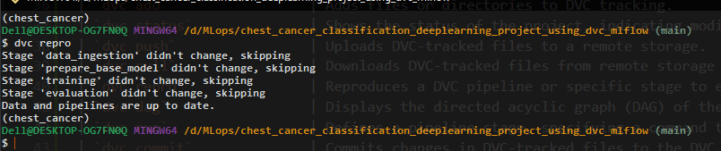
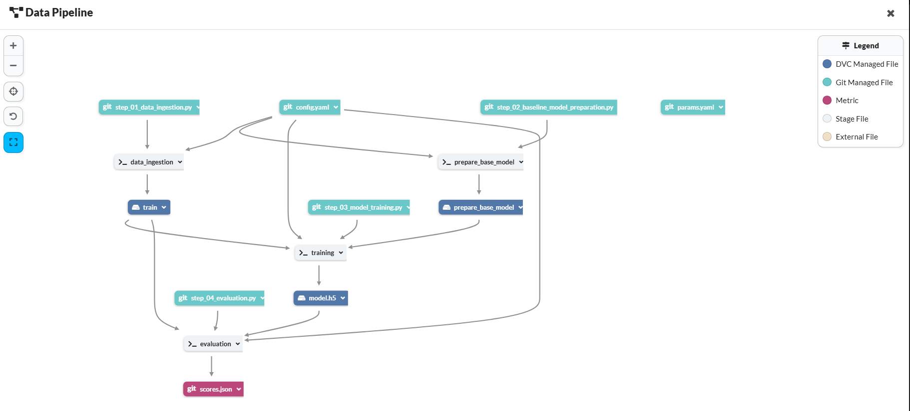

# chestcancer_prediction_using_mlflow_dvc

## Workflows

1. Update config.yaml
2. Update secrets.yaml [Optional]
3. Update params.yaml (models parameters)
4. Update the entity
5. Update the configuration manager in src config
6. Update the components
7. Update the pipeline 
8. Update the main.py
10. Update the dvc.yaml


```bash

# install requirements
$ pip install -r requirements.txt

```

## Dvc Commands

```bash
$ dvc init

$ dvc dag

$ dvc repro  # reproduce the results of a pipeline or a specific stage within a pipeline.

```
| **Command**               | **Description**                                                                 |
|---------------------------|---------------------------------------------------------------------------------|
| `dvc init`                | Initializes a new DVC repository.                                                |
| `dvc add`                 | Adds files or directories to DVC tracking.                                       |
| `dvc status`              | Shows the status of the project, indicating modified or out-of-sync files.      |
| `dvc push`                | Uploads DVC-tracked files to a remote storage.                                  |
| `dvc pull`                | Downloads DVC-tracked files from remote storage to the local machine.           |
| `dvc repro`               | Reproduces a DVC pipeline or specific stage to ensure outputs are up-to-date.   |
| `dvc dag`                 | Displays the directed acyclic graph (DAG) of the pipeline and their dependencies.|
| `dvc run`                 | Defines a pipeline stage, specifying a command to execute and its dependencies. |
| `dvc commit`              | Commits changes in DVC-tracked files to the DVC cache.                          |
| `dvc remove`              | Removes DVC-tracked files or stages from the repository.                        |
| `dvc freeze`              | Locks a stage to prevent it from being rerun.                                   |
| `dvc unfreeze`            | Removes locks on a stage or a set of stages, allowing them to be re-executed.   |
| `dvc remote`              | Manages remote storage configurations for DVC.                                  |
| `dvc config`              | Sets or gets DVC configuration settings.                                        |
| `dvc fetch`               | Downloads DVC-tracked files from remote storage without modifying the workspace.|
| `dvc gc`                  | Garbage collects unused files from the DVC cache.                               |
| `dvc diff`                | Compares two versions of DVC-tracked files or directories.                      |
| `dvc tag`                 | Tags specific versions of DVC-tracked files.                                    |
| `dvc unlock`              | Unlocks frozen stages or files, allowing them to be modified.                   |
| `dvc version`             | Displays the current version of DVC.                                             |
| `dvc untrack`             | Removes DVC tracking from files previously added.                               |
| `dvc push --all-branches` | Pushes all data files across different branches to remote storage.             |
| `dvc pull --no-external`  | Pulls only files tracked within the current workspace, excluding external dependencies. |
| `dvc migrate`             | Migrates data between different DVC storage backends.                           |
| `dvc lock`                | Locks a pipeline or stage from modification.                                    |

#### dvc pipeline skipping the unchanged files run



